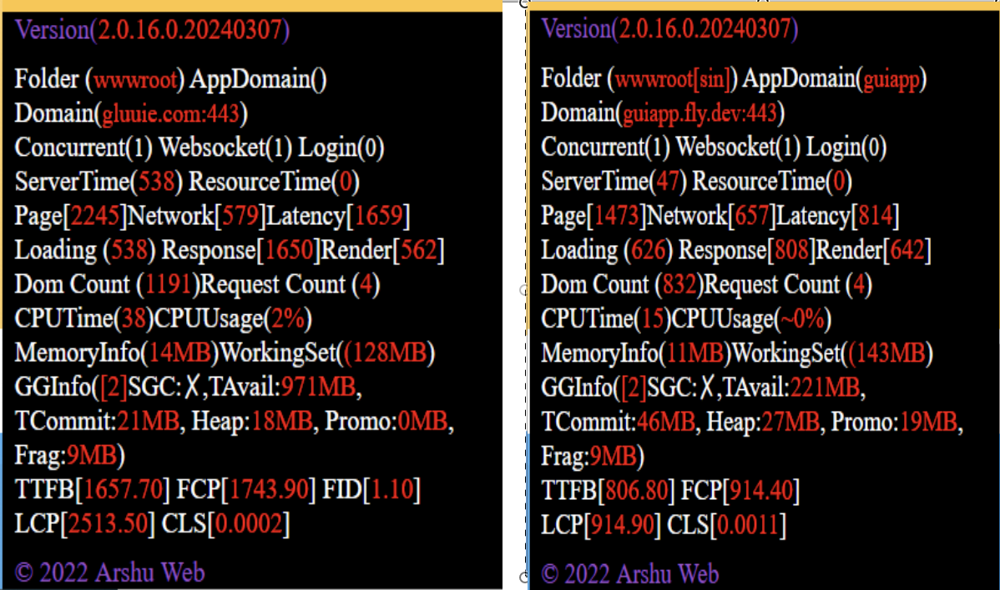

# DotNetCore Performance In Fly.io vs DigitalOcean

 My Custom Declarative AppWeb Framework Based on Html/Json Peformance comparison between Fly.io and Digital Ocean

 # Disclaimer

 I am just recording the performance observation of My Custom Declarative Framework based on Html/Json performance using my measurement code. There may be issues in recording the performance timing in my framwork also.
 
 Both hosting in DigitalOcean or fly.io comes with their own advantages and personally i will be using both depending upon the cicurmstances.

 # Performance Summary

 Fly.io <a href="https://guiapp.fly.io">guiapp</a> app performs approximately 6 to 10 times faster than the same <a href="https://gluuui.com">gluuie</a> app hosting in Digital Ocean

 Note : Click the Bottom Left Corner to get the Performance Tip to be display in the web page.

 "Home Page Performance Comparison").

# Performance Measurement

I have implemented as part of analysis of my declarative framework, various performance measurements, namely

## Server Side Timings

ServerTiming to measure the time taken to generate the web page from html/json components

ResourcTiming to measure the time take to load the html/json resources from file system to memory

## Client Side Timings

Page Timing

Network Timing

Latency Timing

Loading Timing

Response Timing

Render Timing

The below function records the above metrics in the browser

```
    function setPerformanceMetrics() {
        var per = performance;
        if (per) {
            var perfTime = per.timing;
            if (perfTime) {
                var networkInfoElm = document.getElementById("networkInfo");
                if (networkInfoElm) {
                    networkInfoElm.innerHTML = "Page[<span style='color:red;'>" + (perfTime.loadEventEnd - perfTime.navigationStart) + "</span>] Network[<span style='color:red;'>" + (perfTime.loadEventEnd - perfTime.responseEnd) + "</span>] Latency[<span style='color:red;'>" + (perfTime.responseEnd - perfTime.fetchStart) + "</span>]";
                }
                var perfMetricsElm = document.getElementById("perfMetrics");
                if (perfMetricsElm) {
                    perfMetricsElm.innerHTML = "Response[<span style='color:red;'>" + (perfTime.responseEnd - perfTime.requestStart) + "</span>] Render[<span style='color:red;'>" + (perfTime.domComplete - perfTime.domLoading) + "</span>]"
                }
            }
        }
    }
```

The Load Timing is based on the below logic

```
    window.onload = function () {
        var lEcd = new Date();
        var lEt = lEcd.getTime();
        var lTt = (lEt - sT);
        loadingTimeElm.innerHTML = "Loading (<span style='color:red;'>" + lTt + "</span>)";
    }
```

## Client Side - WebVitals Timing

Capturing the Web Vitals Timing using https://github.com/GoogleChrome/web-vitals

